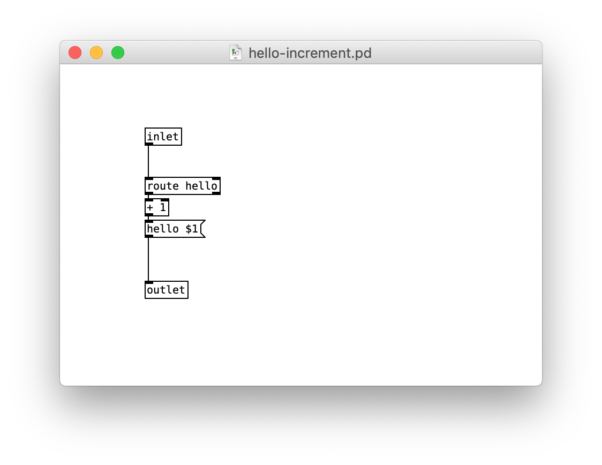

# pd-controller
#### quick and dirty Pure Data process manager for Nodejs

## Introduction

pd-controller is a library that spawns `pd`, `pdsend` and `pdreceive` processes, and wraps them into javascript to provide an interface that allows to manage patch instances and communicate with them via TCP.

Here is a simple example :

```javascript
const Pd = require('pd-controller');
const path = require('path');

// initialize Pd with the `bin` path of pure data
// (where the `pd`, `pdsend`, and `pdreceive` binaries are located)

Pd.init('/Applications/Pd-0.49-1-x86_64.app/Contents/Resources/bin')
.then(() => {
    const myPatch = Pd.open(path.join(__dirname, 'hello-increment')); // patch name without '.pd' extension
    myPatch.on('message', (msg) => {
        console.log(`pure data says ${msg}`);
    });
    myPatch.send('hello', 1);
    Pd.close(myPatch);
});
```



## How it works

When pd-controller is initialized, it kills every running `pd`, `pdsend` and `pdreceive` processes, then spawns one of each, opening two default patches with `pd` for communication with `pdsend` and `pdreceive` and patch instance management.

When opening a patch, pd-controller creates a temporary wrapper .pd file and assigns it a unique id, which is the patch's first argument ($1). Other normal arguments can be passed at instantiation time and retrieved in the patch as $2, $3, etc.

Each patch to be loaded with pd-controller must have an inlet to receive the data sent from the `send` method in nodejs, and an outlet to send messages which will be emitted as `message` events in nodejs.

## Caveats

Sometimes, when pd-controller is initialized too many times in a short amount of time, the`pdsend` and `pdreceive` binaries cannot use the latest TCP port, maybe due to OS restrictions to prevent DDOS attacks. When this happens, the `Pd.init()` method tries to kill and respawn the binaries every 5 seconds until it succeeds (usually in less than 1 minute), then returns a resolved Promise.
